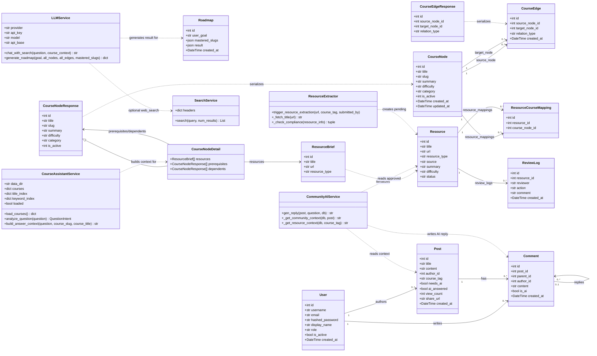
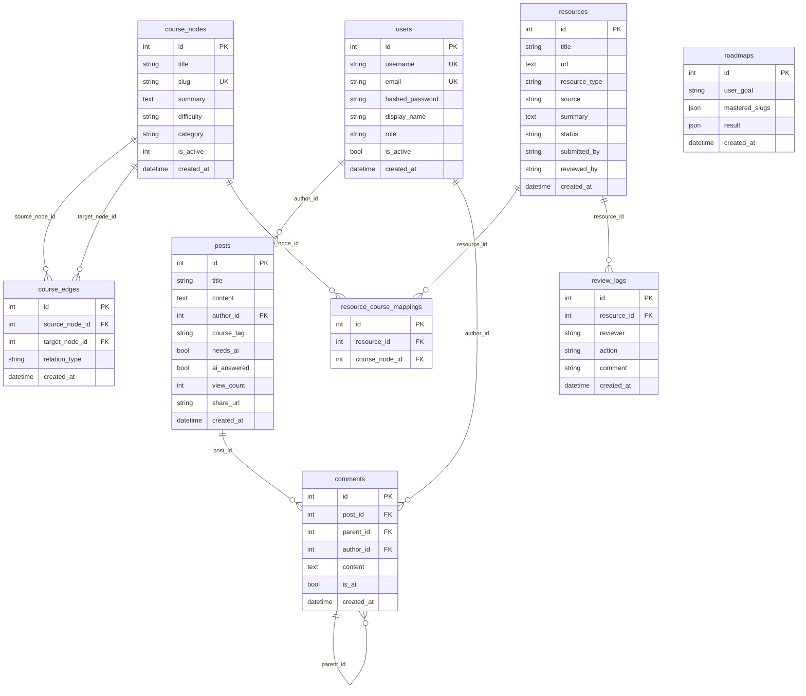
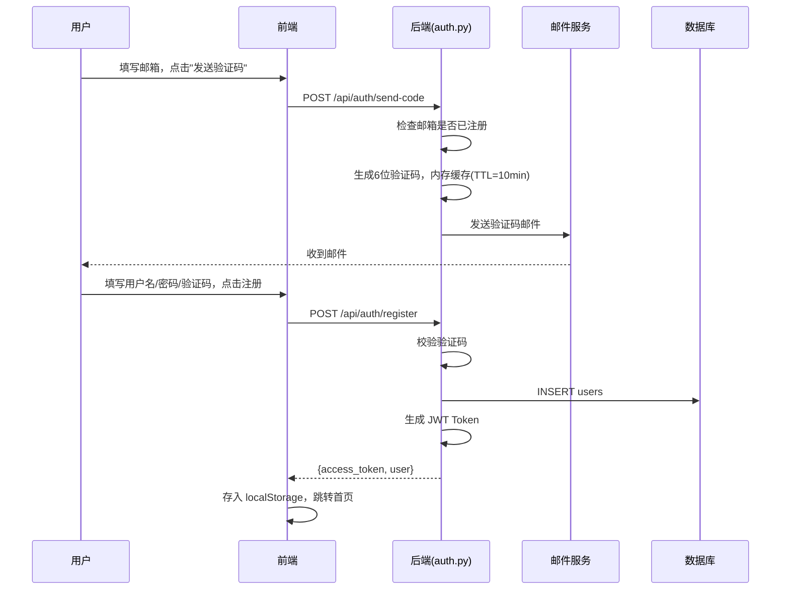
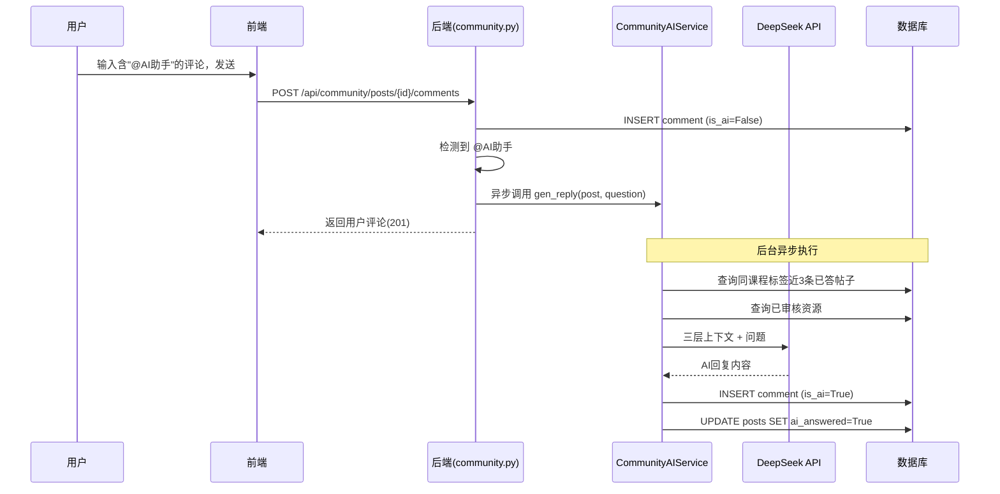
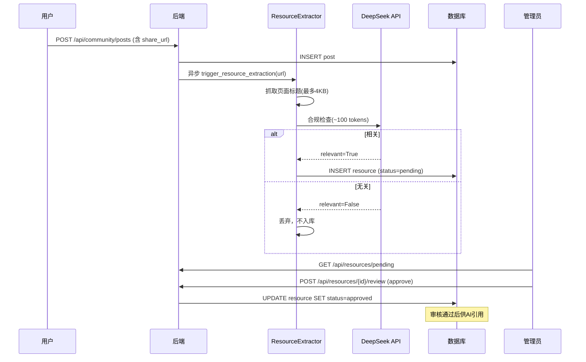

# 知南系统 UML 图

## 后端核心类图

```mermaid
classDiagram
    direction LR

    class CourseNode {
        +int id
        +str title
        +str slug
        +str summary
        +str difficulty
        +str category
        +int is_active
        +DateTime created_at
        +DateTime updated_at
    }

    class CourseEdge {
        +int id
        +int source_node_id
        +int target_node_id
        +str relation_type
        +DateTime created_at
    }

    class Resource {
        +int id
        +str title
        +str url
        +str resource_type
        +str source
        +str summary
        +str difficulty
        +str status
    }

    class ResourceCourseMapping {
        +int id
        +int resource_id
        +int course_node_id
    }

    class Roadmap {
        +int id
        +str user_goal
        +json mastered_slugs
        +json result
        +DateTime created_at
    }

    class ReviewLog {
        +int id
        +int resource_id
        +str reviewer
        +str action
        +str comment
        +DateTime created_at
    }

    class CourseNodeResponse {
        +int id
        +str title
        +str slug
        +str summary
        +str difficulty
        +str category
        +int is_active
    }

    class CourseNodeDetail {
        +ResourceBrief[] resources
        +CourseNodeResponse[] prerequisites
        +CourseNodeResponse[] dependents
    }

    class CourseEdgeResponse {
        +int id
        +int source_node_id
        +int target_node_id
        +str relation_type
    }

    class ResourceBrief {
        +int id
        +str title
        +str url
        +str resource_type
    }

    class CourseAssistantService {
        +str data_dir
        +dict courses
        +dict title_index
        +dict keyword_index
        +bool loaded
        +load_courses() dict
        +analyze_question(question) QuestionIntent
        +build_answer_context(question, course_slug, course_title) str
    }

    class LLMService {
        +str provider
        +str api_key
        +str model
        +str api_base
        +chat_with_search(question, course_context) str
        +generate_roadmap(goal, all_nodes, all_edges, mastered_slugs) dict
    }

    class SearchService {
        +dict headers
        +search(query, num_results) List
    }

    CourseNode "1" --> "0..*" CourseEdge : source_node
    CourseNode "1" --> "0..*" CourseEdge : target_node
    CourseNode "1" --> "0..*" ResourceCourseMapping : resource_mappings
    Resource "1" --> "0..*" ResourceCourseMapping : resource_mappings
    Resource "1" --> "0..*" ReviewLog : review_logs

    CourseNodeResponse <|-- CourseNodeDetail
    CourseNodeDetail --> ResourceBrief : resources
    CourseNodeDetail --> CourseNodeResponse : prerequisites/dependents
    CourseEdgeResponse ..> CourseEdge : serializes
    CourseNodeResponse ..> CourseNode : serializes
    ResourceBrief ..> Resource : serializes

    CourseAssistantService ..> CourseNodeDetail : builds context for
    LLMService ..> SearchService : optional web_search
    LLMService ..> Roadmap : generates result for

    class User {
        +int id
        +str username
        +str email
        +str hashed_password
        +str display_name
        +str role
        +bool is_active
        +DateTime created_at
    }

    class Post {
        +int id
        +str title
        +str content
        +int author_id
        +str course_tag
        +bool needs_ai
        +bool ai_answered
        +int view_count
        +str share_url
        +DateTime created_at
    }

    class Comment {
        +int id
        +int post_id
        +int parent_id
        +int author_id
        +str content
        +bool is_ai
        +DateTime created_at
    }

    class CommunityAIService {
        +gen_reply(post, question, db) str
        +_get_community_context(db, post) str
        +_get_resource_context(db, course_tag) str
    }

    class ResourceExtractor {
        +trigger_resource_extraction(url, course_tag, submitted_by)
        +_fetch_title(url) str
        +_check_compliance(resource_info) tuple
    }

    User "1" --> "0..*" Post : authors
    User "1" --> "0..*" Comment : writes
    Post "1" --> "0..*" Comment : has
    Comment "0..1" --> "0..*" Comment : replies
    CommunityAIService ..> Post : reads context
    CommunityAIService ..> Resource : reads approved
    CommunityAIService ..> Comment : writes AI reply
    ResourceExtractor ..> Resource : creates pending
```

---

## ER 图（实体关系图）

```mermaid
erDiagram
    users {
        int id PK
        string username UK
        string email UK
        string hashed_password
        string display_name
        string role
        bool is_active
        datetime created_at
    }

    posts {
        int id PK
        string title
        text content
        int author_id FK
        string course_tag
        bool needs_ai
        bool ai_answered
        int view_count
        string share_url
        datetime created_at
    }

    comments {
        int id PK
        int post_id FK
        int parent_id FK
        int author_id FK
        text content
        bool is_ai
        datetime created_at
    }

    course_nodes {
        int id PK
        string title
        string slug UK
        text summary
        string difficulty
        string category
        int is_active
        datetime created_at
    }

    course_edges {
        int id PK
        int source_node_id FK
        int target_node_id FK
        string relation_type
        datetime created_at
    }

    resources {
        int id PK
        string title
        text url
        string resource_type
        string source
        text summary
        string status
        string submitted_by
        string reviewed_by
        datetime created_at
    }

    resource_course_mappings {
        int id PK
        int resource_id FK
        int course_node_id FK
    }

    roadmaps {
        int id PK
        string user_goal
        json mastered_slugs
        json result
        datetime created_at
    }

    review_logs {
        int id PK
        int resource_id FK
        string reviewer
        string action
        string comment
        datetime created_at
    }

    users ||--o{ posts : "author_id"
    users ||--o{ comments : "author_id"
    posts ||--o{ comments : "post_id"
    comments ||--o{ comments : "parent_id"
    course_nodes ||--o{ course_edges : "source_node_id"
    course_nodes ||--o{ course_edges : "target_node_id"
    resources ||--o{ resource_course_mappings : "resource_id"
    course_nodes ||--o{ resource_course_mappings : "course_node_id"
    resources ||--o{ review_logs : "resource_id"
```

---

## 关键流程时序图

### 用户注册流程

```mermaid
sequenceDiagram
    participant U as 用户
    participant F as 前端
    participant B as 后端(auth.py)
    participant E as 邮件服务
    participant DB as 数据库

    U->>F: 填写邮箱，点击"发送验证码"
    F->>B: POST /api/auth/send-code
    B->>B: 检查邮箱是否已注册
    B->>B: 生成6位验证码，内存缓存(TTL=10min)
    B->>E: 发送验证码邮件
    E-->>U: 收到邮件
    U->>F: 填写用户名/密码/验证码，点击注册
    F->>B: POST /api/auth/register
    B->>B: 校验验证码
    B->>DB: INSERT users
    B->>B: 生成 JWT Token
    B-->>F: {access_token, user}
    F->>F: 存入 localStorage，跳转首页
```

### @AI助手触发流程

```mermaid
sequenceDiagram
    participant U as 用户
    participant F as 前端
    participant B as 后端(community.py)
    participant AI as CommunityAIService
    participant LLM as DeepSeek API
    participant DB as 数据库

    U->>F: 输入含"@AI助手"的评论，发送
    F->>B: POST /api/community/posts/{id}/comments
    B->>DB: INSERT comment (is_ai=False)
    B->>B: 检测到 @AI助手
    B->>AI: 异步调用 gen_reply(post, question)
    B-->>F: 返回用户评论(201)
    Note over AI,DB: 后台异步执行
    AI->>DB: 查询同课程标签近3条已答帖子
    AI->>DB: 查询已审核资源
    AI->>LLM: 三层上下文 + 问题
    LLM-->>AI: AI回复内容
    AI->>DB: INSERT comment (is_ai=True)
    AI->>DB: UPDATE posts SET ai_answered=True
```

### 资源分享审核流程

```mermaid
sequenceDiagram
    participant U as 用户
    participant B as 后端
    participant RE as ResourceExtractor
    participant LLM as DeepSeek API
    participant DB as 数据库
    participant ADM as 管理员

    U->>B: POST /api/community/posts (含 share_url)
    B->>DB: INSERT post
    B->>RE: 异步 trigger_resource_extraction(url)
    RE->>RE: 抓取页面标题(最多4KB)
    RE->>LLM: 合规检查(~100 tokens)
    alt 相关
        LLM-->>RE: relevant=True
        RE->>DB: INSERT resource (status=pending)
    else 无关
        LLM-->>RE: relevant=False
        RE->>RE: 丢弃，不入库
    end
    ADM->>B: GET /api/resources/pending
    ADM->>B: POST /api/resources/{id}/review (approve)
    B->>DB: UPDATE resource SET status=approved
    Note over DB: 审核通过后供AI引用
```

