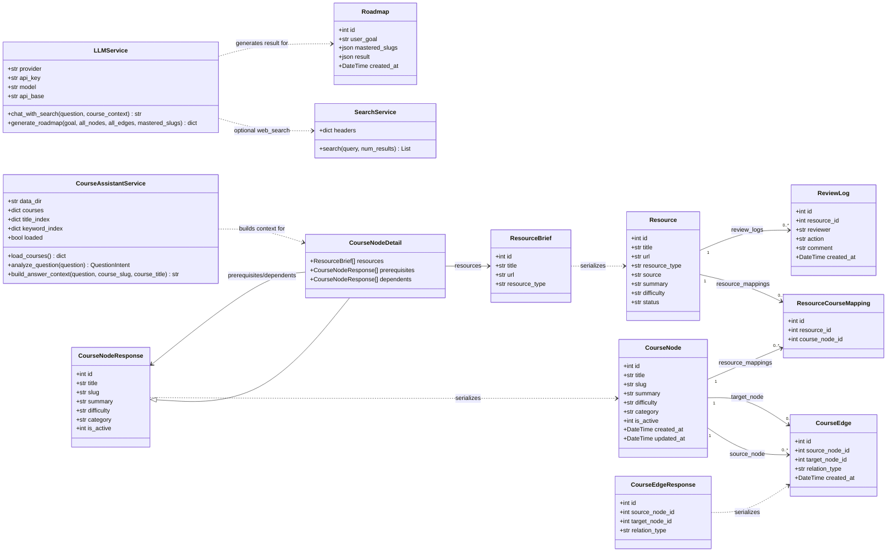

# 知南系统 UML 图

## 后端核心类图

```mermaid
classDiagram
    direction LR

    class CourseNode {
        +int id
        +str title
        +str slug
        +str summary
        +str difficulty
        +str category
        +int is_active
        +DateTime created_at
        +DateTime updated_at
    }

    class CourseEdge {
        +int id
        +int source_node_id
        +int target_node_id
        +str relation_type
        +DateTime created_at
    }

    class Resource {
        +int id
        +str title
        +str url
        +str resource_type
        +str source
        +str summary
        +str difficulty
        +str status
    }

    class ResourceCourseMapping {
        +int id
        +int resource_id
        +int course_node_id
    }

    class Roadmap {
        +int id
        +str user_goal
        +json mastered_slugs
        +json result
        +DateTime created_at
    }

    class ReviewLog {
        +int id
        +int resource_id
        +str reviewer
        +str action
        +str comment
        +DateTime created_at
    }

    class CourseNodeResponse {
        +int id
        +str title
        +str slug
        +str summary
        +str difficulty
        +str category
        +int is_active
    }

    class CourseNodeDetail {
        +ResourceBrief[] resources
        +CourseNodeResponse[] prerequisites
        +CourseNodeResponse[] dependents
    }

    class CourseEdgeResponse {
        +int id
        +int source_node_id
        +int target_node_id
        +str relation_type
    }

    class ResourceBrief {
        +int id
        +str title
        +str url
        +str resource_type
    }

    class CourseAssistantService {
        +str data_dir
        +dict courses
        +dict title_index
        +dict keyword_index
        +bool loaded
        +load_courses() dict
        +analyze_question(question) QuestionIntent
        +build_answer_context(question, course_slug, course_title) str
    }

    class LLMService {
        +str provider
        +str api_key
        +str model
        +str api_base
        +chat_with_search(question, course_context) str
        +generate_roadmap(goal, all_nodes, all_edges, mastered_slugs) dict
    }

    class SearchService {
        +dict headers
        +search(query, num_results) List
    }

    CourseNode "1" --> "0..*" CourseEdge : source_node
    CourseNode "1" --> "0..*" CourseEdge : target_node
    CourseNode "1" --> "0..*" ResourceCourseMapping : resource_mappings
    Resource "1" --> "0..*" ResourceCourseMapping : resource_mappings
    Resource "1" --> "0..*" ReviewLog : review_logs

    CourseNodeResponse <|-- CourseNodeDetail
    CourseNodeDetail --> ResourceBrief : resources
    CourseNodeDetail --> CourseNodeResponse : prerequisites/dependents
    CourseEdgeResponse ..> CourseEdge : serializes
    CourseNodeResponse ..> CourseNode : serializes
    ResourceBrief ..> Resource : serializes

    CourseAssistantService ..> CourseNodeDetail : builds context for
    LLMService ..> SearchService : optional web_search
    LLMService ..> Roadmap : generates result for
```

