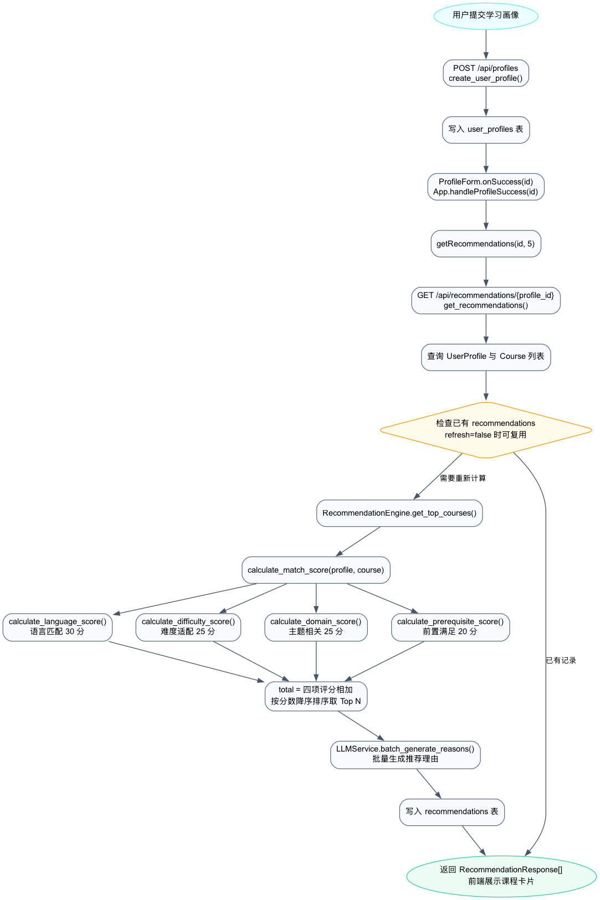

# AI 学习资源站典型业务流程详细设计说明书

## 1、系统概述

### 1.1、文档目的

本文档用于描述 AI 学习资源站中的典型业务流程：用户画像驱动的课程智能推荐流程。

本文档对应老师要求中的第二类详细设计：描述一个典型业务流程或项目中算法较复杂的部分。由于单个函数无法完整表达“画像采集、课程评分、排序、推荐理由生成、结果入库和前端展示”的全过程，因此本文档按照设计思路拆解多个函数和方法，并说明它们之间的调用关系。

### 1.2、业务功能定位

课程推荐是系统的核心演示功能之一。它的目标是根据用户当前知识基础、学习目标和职业方向，从课程库中选出最适合用户的课程，并给出匹配分数、评分明细和推荐理由。

该功能体现了系统的主要价值：

1. 将用户输入转换为结构化用户画像。
2. 将课程库中的课程转换为可比较的候选对象。
3. 通过多维度评分算法计算课程匹配度。
4. 按匹配度排序输出 Top N 推荐课程。
5. 使用 LLM 生成更容易理解的推荐理由。
6. 将推荐结果保存，支持后续复用。

## 2、业务流程总体设计

用户画像驱动的课程推荐流程如下图所示：



## 3、业务流程说明

### 3.1、完整流程

课程推荐业务流程如下：

1. 用户在前端填写学习画像。
2. 前端调用 `createUserProfile` 将画像提交到后端。
3. 后端 `create_user_profile` 创建 `UserProfile` 记录。
4. 创建成功后，前端 `handleProfileSuccess` 接收画像 ID。
5. 前端调用 `getRecommendations(id, 5)` 请求推荐结果。
6. 后端 `get_recommendations` 查询画像和课程数据。
7. 后端判断是否已有可复用推荐记录。
8. 如果没有可复用记录，则调用推荐引擎计算课程分数。
9. 推荐引擎遍历课程库，对每门课程调用 `calculate_match_score`。
10. `calculate_match_score` 调用四个评分函数完成语言、难度、主题和前置知识评分。
11. 推荐引擎将课程按总分降序排序，取前 N 门课程。
12. 后端调用 `LLMService.batch_generate_reasons` 批量生成推荐理由。
13. 后端将推荐结果保存到 `recommendations` 表。
14. 后端返回 `RecommendationResponse` 列表。
15. 前端将推荐结果展示为课程卡片和评分明细。

### 3.2、业务输入

推荐流程的主要输入是用户画像和课程数据。

#### 用户画像输入

| 字段 | 类型 | 说明 |
| --- | --- | --- |
| `current_knowledge.programming_languages` | `List[str]` | 用户已掌握的编程语言 |
| `current_knowledge.completed_courses` | `List[str]` | 用户已完成课程 |
| `current_knowledge.skill_level` | `str` | 用户技能水平，取值为 `beginner`、`intermediate`、`advanced` |
| `learning_goals.target_skills` | `List[str]` | 用户希望掌握的目标技能 |
| `learning_goals.specific_topics` | `List[str]` | 用户关注的具体主题 |
| `career_direction.target_role` | `str` | 用户目标岗位 |
| `career_direction.preferred_language` | `str` | 用户偏好编程语言 |
| `career_direction.industry` | `str` | 用户目标行业 |

#### 课程数据输入

| 字段 | 类型 | 说明 |
| --- | --- | --- |
| `course_code` | `str` | 课程编号 |
| `title` | `str` | 课程名称 |
| `difficulty_level` | `str` | 课程难度 |
| `programming_languages` | `List[str]` | 课程使用语言 |
| `topics` | `List[str]` | 课程主题 |
| `prerequisites` | `List[str]` | 前置课程或前置知识 |
| `domain` | `str` | 课程所属领域 |
| `suitable_for_careers` | `List[str]` | 适合的职业方向 |

### 3.3、业务输出

推荐流程输出 `RecommendationResponse` 列表。

| 字段 | 类型 | 说明 |
| --- | --- | --- |
| `course` | `CourseResponse` | 被推荐课程的完整信息 |
| `match_score` | `float` | 总匹配分数 |
| `recommendation_reason` | `str` | 推荐理由 |
| `score_breakdown.language_match` | `float` | 编程语言匹配分数 |
| `score_breakdown.difficulty_match` | `float` | 难度适配分数 |
| `score_breakdown.domain_relevance` | `float` | 主题相关分数 |
| `score_breakdown.prerequisite_fit` | `float` | 前置知识满足分数 |

## 4、函数与方法设计

### 4.1、前端函数

| 函数 | 所在文件 | 功能 | 参数 | 返回值 |
| --- | --- | --- | --- | --- |
| `createUserProfile` | `frontend/src/services/api.ts` | 创建用户画像 | `profile` | 后端返回的画像数据 |
| `handleProfileSuccess` | `frontend/src/App.tsx` | 画像创建成功后的推荐调度 | `id` | 无 |
| `getRecommendations` | `frontend/src/services/api.ts` | 请求课程推荐 | `profileId`、`topN`、`refresh` | `Recommendation[]` |

### 4.2、后端接口函数

| 函数 | 所在文件 | 功能 | 参数 | 返回值 |
| --- | --- | --- | --- | --- |
| `create_user_profile` | `backend/app/api/routes.py` | 保存用户画像 | `profile`、`db` | `UserProfileResponse` |
| `get_recommendations` | `backend/app/api/routes.py` | 推荐流程总调度 | `profile_id`、`top_n`、`refresh`、`db` | `List[RecommendationResponse]` |

### 4.3、推荐引擎方法

| 方法 | 所在类 | 功能 | 参数 | 返回值 |
| --- | --- | --- | --- | --- |
| `get_top_courses` | `RecommendationEngine` | 遍历课程、计算分数并排序 | `user_profile`、`all_courses`、`top_n` | 推荐课程字典列表 |
| `calculate_match_score` | `RecommendationEngine` | 计算一门课程的总分和明细 | `user_profile`、`course` | `Dict[str, float]` |
| `calculate_language_score` | `RecommendationEngine` | 计算编程语言匹配分 | `user_preferred_lang`、`course_languages` | `float` |
| `calculate_difficulty_score` | `RecommendationEngine` | 计算难度适配分 | `user_level`、`course_difficulty` | `float` |
| `calculate_domain_score` | `RecommendationEngine` | 计算学习目标和课程主题相关度 | `user_goals`、`course_topics` | `float` |
| `calculate_prerequisite_score` | `RecommendationEngine` | 计算前置知识满足度 | `user_completed`、`course_prerequisites` | `float` |

### 4.4、LLM 服务方法

| 方法 | 所在类 | 功能 | 参数 | 返回值 |
| --- | --- | --- | --- | --- |
| `batch_generate_reasons` | `LLMService` | 批量生成推荐理由 | `user_profile`、`courses_info`、`match_scores` | `List[str]` |
| `_call_llm` | `LLMService` | 调用外部 LLM 接口 | `system_prompt`、`user_prompt`、`max_tokens` | `Optional[str]` |
| `_parse_batch_reasons` | `LLMService` | 解析 LLM 返回的多条推荐理由 | `content`、`n`、`user_profile`、`courses_info`、`match_scores` | `List[str]` |
| `_generate_template_reason` | `LLMService` | LLM 不可用时生成模板理由 | `user_profile`、`course_info`、`match_score` | `str` |

## 5、推荐算法详细设计

### 5.1、评分维度

推荐算法采用四维度评分，总分为 100 分。

| 评分维度 | 最高分 | 对应函数 | 设计含义 |
| --- | --- | --- | --- |
| 编程语言匹配 | 30 | `calculate_language_score` | 用户偏好语言和课程语言是否一致 |
| 难度适配 | 25 | `calculate_difficulty_score` | 课程难度是否适合用户水平 |
| 领域相关 | 25 | `calculate_domain_score` | 用户目标技能和课程主题是否相关 |
| 前置知识满足 | 20 | `calculate_prerequisite_score` | 用户已完成课程是否覆盖前置要求 |

总分计算公式：

```text
match_score =
  language_match
  + difficulty_match
  + domain_relevance
  + prerequisite_fit
```

### 5.2、语言匹配算法

语言匹配优先判断用户偏好语言是否直接出现在课程语言列表中。

算法规则：

1. 如果用户偏好语言与课程语言完全匹配，得 30 分。
2. 如果存在相似语言匹配，得 15 分。
3. 如果不匹配，得 0 分。

相似语言示例：

| 用户语言 | 相似语言 |
| --- | --- |
| `Python` | `Python3` |
| `C++` | `C`、`C++11`、`C++14` |
| `Java` | `Kotlin` |
| `JavaScript` | `TypeScript` |

### 5.3、难度适配算法

难度适配将用户水平和课程难度映射为数字。

| 水平 | 数值 |
| --- | --- |
| `beginner` | 1 |
| `intermediate` | 2 |
| `advanced` | 3 |

算法规则：

| 课程难度与用户水平差值 | 得分 | 含义 |
| --- | --- | --- |
| `0` | 25 | 难度完全匹配 |
| `1` | 20 | 课程略高，适合进阶 |
| `-1` | 15 | 课程略低，可用于补基础 |
| 其他 | 5 | 难度差距较大 |

### 5.4、领域相关算法

领域相关度使用 Jaccard 相似度计算用户目标技能和课程主题的重合程度。

```text
jaccard_similarity = intersection(user_goals, course_topics) / union(user_goals, course_topics)
domain_score = jaccard_similarity * 25
```

该算法适合当前课程数据规模，能够直观反映目标技能与课程主题的相关性。

### 5.5、前置知识算法

前置知识满足度用于判断用户已完成课程是否覆盖当前课程的前置要求。

算法规则：

1. 如果课程没有前置要求，直接得 20 分。
2. 如果有前置要求，则计算用户已完成课程与前置要求的交集比例。

```text
prerequisite_score =
  count(user_completed ∩ course_prerequisites)
  / count(course_prerequisites)
  * 20
```

## 6、数据存储设计

### 6.1、相关数据表

| 数据表 | 作用 |
| --- | --- |
| `user_profiles` | 保存用户学习画像 |
| `courses` | 保存候选课程数据 |
| `recommendations` | 保存推荐结果、匹配分数、推荐理由和评分明细 |

### 6.2、数据流向

1. `create_user_profile` 写入 `user_profiles` 表。
2. `get_recommendations` 读取 `user_profiles` 和 `courses` 表。
3. 推荐引擎生成分数后，接口函数写入 `recommendations` 表。
4. 前端读取接口返回结果，不直接访问数据库。

## 7、面向对象设计说明

推荐业务使用面向对象思想封装核心算法。

| 类 | 类型 | 说明 |
| --- | --- | --- |
| `RecommendationEngine` | 业务服务类 | 封装推荐评分、排序和 Top N 筛选 |
| `LLMService` | 外部服务类 | 封装 LLM 请求、推荐理由生成和回退逻辑 |
| `UserProfile` | 数据模型类 | 映射用户画像表 |
| `Course` | 数据模型类 | 映射课程表 |
| `Recommendation` | 数据模型类 | 映射推荐结果表 |

该设计的好处：

1. 推荐算法集中在 `RecommendationEngine` 中，便于维护。
2. LLM 相关逻辑集中在 `LLMService` 中，便于替换模型供应商。
3. API 路由只负责编排流程，不直接写复杂算法。
4. 数据模型与数据库表对应，便于持久化和查询。

## 8、异常处理设计

| 异常场景 | 出现位置 | 处理方式 |
| --- | --- | --- |
| 用户画像不存在 | `get_recommendations` | 返回 HTTP 404，提示用户画像不存在 |
| 课程数据为空 | `get_recommendations` | 返回 HTTP 404，提示暂无课程数据 |
| 已有推荐记录 | `get_recommendations` | 默认复用已有记录，减少重复计算 |
| 强制刷新推荐 | `get_recommendations` | `refresh=true` 时重新计算 |
| LLM API Key 不存在 | `LLMService.batch_generate_reasons` | 使用模板推荐理由 |
| LLM 调用失败 | `LLMService._call_llm` | 返回 `None`，转入模板理由 |
| LLM 返回格式不稳定 | `_parse_batch_reasons` | 解析不足时用模板理由补齐 |
| 前端请求失败 | `handleProfileSuccess` | 显示错误提示并结束 loading |

## 9、性能设计

课程推荐流程当前做了以下性能优化：

1. 推荐结果默认缓存到 `recommendations` 表，再次请求时可复用。
2. 推荐理由采用批量生成方式，避免对每门课程逐次调用 LLM。
3. 推荐评分在内存中遍历课程列表，适合当前课程数据规模。
4. 前端使用 loading 状态避免重复提交。

后续可扩展优化：

1. 对课程主题建立索引，提高大规模课程检索效率。
2. 将评分权重配置化，支持不同用户群体使用不同权重。
3. 引入向量相似度或协同过滤，增强推荐精度。
4. 对热门画像或热门课程推荐结果建立缓存。

## 10、与代码的对应关系

| 设计环节 | 对应代码 |
| --- | --- |
| 画像创建 API | `backend/app/api/routes.py` 的 `create_user_profile` |
| 推荐接口总调度 | `backend/app/api/routes.py` 的 `get_recommendations` |
| 推荐引擎类 | `backend/app/services/recommendation_engine.py` 的 `RecommendationEngine` |
| 推荐理由服务 | `backend/app/services/llm_service.py` 的 `LLMService` |
| 前端推荐触发 | `frontend/src/App.tsx` 的 `handleProfileSuccess` |
| 前端 API 封装 | `frontend/src/services/api.ts` 的 `getRecommendations` |
| 推荐响应结构 | `backend/app/schemas/schemas.py` 的 `RecommendationResponse` |

## 11、小结

课程推荐业务是系统最适合作为核心演示的典型业务流程。该流程从用户画像创建开始，经由前端调度、后端接口、推荐引擎多维度评分、LLM 推荐理由生成和数据库保存，最终返回前端展示。由于该业务涉及多个函数和类之间的协作，本文档将其拆解为清晰的函数调用关系和算法步骤，能够与概要设计和现有代码保持对应。
