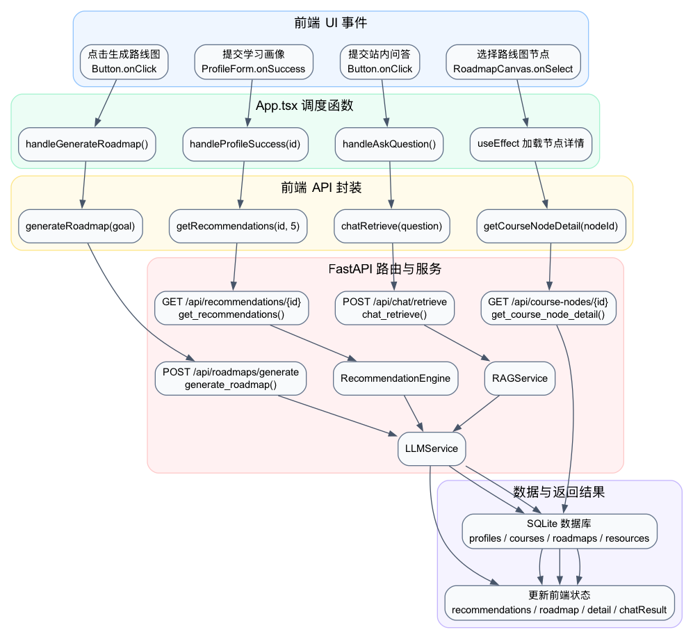

# AI 学习资源站控制与调度详细设计说明书

## 1、系统概述

### 1.1、文档目的

本文档用于说明 AI 学习资源站中“控制或调度”相关的详细设计，重点描述用户界面事件如何触发前端调度函数，前端调度函数如何调用 API 封装，后端 FastAPI 路由如何进一步分发到推荐引擎、路线图服务、课程图谱服务和 RAG 问答服务。

本文档对应老师要求中的第一类详细设计：用于控制或调度的文档。由于本系统主要通过 Web UI 交互和 HTTP API 触发业务流程，因此本文档重点采用“UI 事件映射 + API 路由调度 + 服务对象调用”的方式进行描述。

### 1.2、控制调度范围

本文档覆盖以下控制调度流程：

1. 学习画像提交后自动触发课程推荐。
2. 用户点击按钮生成学习路线图。
3. 用户选择路线图节点后加载节点详情与关联资源。
4. 用户提交问题后触发站内资料检索问答。
5. 后端接口根据请求类型调度不同业务服务。

### 1.3、设计思想

系统整体不是纯面向对象程序，而是采用“面向对象思想 + 分层架构 + 接口驱动”的实现方式。

- 前端采用 React 函数组件和状态驱动方式实现界面控制。
- 前端 `App.tsx` 作为工作台控制中心，负责组织状态变化和调度 API 调用。
- 后端使用 FastAPI 路由函数作为请求入口，负责参数校验、异常处理和服务分发。
- 推荐引擎、LLM 服务、RAG 服务等核心能力被封装为服务对象，体现面向对象封装思想。
- 数据库模型使用 SQLAlchemy 类映射数据库表，体现对象关系映射思想。

## 2、控制调度总体结构

系统控制调度链路如下图所示：

图1展示了用户操作、前端调度函数、API 封装、后端路由、业务服务和数据库之间的调用关系。

## 3、控制入口设计

### 3.1、前端控制入口

前端控制入口主要位于 `frontend/src/App.tsx` 和 `frontend/src/components/Profile/ProfileForm.tsx`。

| 序号 | 用户操作 | 前端入口 | 调度函数 | 调用 API |
| --- | --- | --- | --- | --- |
| 1 | 提交学习画像 | `ProfileForm` 表单提交成功 | `handleProfileSuccess(id)` | `getRecommendations(id, 5)` |
| 2 | 点击生成路线图 | 路线图区按钮 | `handleGenerateRoadmap()` | `generateRoadmap(goal)` |
| 3 | 选择路线图节点 | `RoadmapCanvas` 节点交互 | `useEffect` 监听选中节点 | `getCourseNodeDetail(nodeId)` |
| 4 | 提交资料问答 | RAG 问答按钮 | `handleAskQuestion()` | `chatRetrieve(question)` |
| 5 | 重置工作台 | 重置按钮 | `handleReset()` | 无后端调用 |

### 3.2、后端控制入口

后端控制入口主要位于 `backend/app/api/` 目录。

| 序号 | API 路径 | 请求方法 | 后端函数 | 调度目标 |
| --- | --- | --- | --- | --- |
| 1 | `/api/profiles` | POST | `create_user_profile` | 创建用户画像 |
| 2 | `/api/recommendations/{profile_id}` | GET | `get_recommendations` | 推荐引擎、LLM 服务 |
| 3 | `/api/roadmaps/generate` | POST | `generate_roadmap` | 课程图谱、LLM 服务 |
| 4 | `/api/course-nodes/{node_id}` | GET | `get_course_node_detail` | 课程节点与资源查询 |
| 5 | `/api/chat/retrieve` | POST | `chat_retrieve` | RAG 检索服务、LLM 服务 |

## 4、前端调度设计

### 4.1、学习画像提交调度

学习画像表单提交成功后，`ProfileForm` 将后端创建的画像 ID 回传给 `App.tsx`，由 `handleProfileSuccess` 统一调度推荐加载。

调度流程：

1. 接收画像 ID。
2. 保存当前 `profileId`。
3. 设置 `loading` 状态为 `true`。
4. 调用 `getRecommendations(id, 5)` 请求后端推荐。
5. 将返回的推荐结果写入 `recommendations` 状态。
6. 默认选中第一门课程。
7. 显示成功或错误提示。

对应函数：

| 函数 | 所在文件 | 作用 |
| --- | --- | --- |
| `handleProfileSuccess` | `frontend/src/App.tsx` | 画像提交成功后的推荐调度 |
| `getRecommendations` | `frontend/src/services/api.ts` | 封装推荐 API 请求 |
| `get_recommendations` | `backend/app/api/routes.py` | 后端推荐接口入口 |

### 4.2、路线图生成调度

路线图生成由用户点击“生成路线图”按钮触发。

调度流程：

1. 检查 `goalPrompt` 是否为空。
2. 设置 `roadmapLoading` 状态为 `true`。
3. 调用 `generateRoadmap(goalPrompt.trim())`。
4. 后端根据课程节点、边和用户目标生成路线图。
5. 前端保存 `roadmap` 状态。
6. 默认选中路线图第一个节点。
7. 根据结果刷新路线图展示区域。

对应函数：

| 函数 | 所在文件 | 作用 |
| --- | --- | --- |
| `handleGenerateRoadmap` | `frontend/src/App.tsx` | 路线图生成调度 |
| `generateRoadmap` | `frontend/src/services/api.ts` | 封装路线图生成请求 |
| `generate_roadmap` | `backend/app/api/roadmap.py` | 后端路线图生成入口 |
| `LLMService.generate_roadmap` | `backend/app/services/llm_service.py` | 调用 LLM 生成路线图 JSON |

### 4.3、路线图节点详情调度

当前端选中路线图节点后，`App.tsx` 根据节点 slug 匹配课程节点，再调用详情接口加载节点资料。

调度流程：

1. 前端保存选中节点 slug。
2. `useEffect` 监听 `selectedRoadmapNode` 变化。
3. 从 `courseNodes` 中匹配对应节点。
4. 调用 `getCourseNodeDetail(matched.id)`。
5. 将返回结果写入 `selectedCourseNodeDetail`。
6. 右侧资源区展示节点关联资源。

### 4.4、RAG 问答调度

RAG 问答由用户输入问题并点击提交按钮触发。

调度流程：

1. 检查问题是否为空。
2. 设置 `chatLoading` 状态。
3. 调用 `chatRetrieve(question.trim())`。
4. 后端执行资料检索和答案生成。
5. 前端将结果保存到 `chatResult`。
6. 界面展示回答内容和引用资料。

## 5、后端路由调度设计

### 5.1、推荐接口调度

`get_recommendations` 是推荐流程的后端调度中心。

主要职责：

1. 根据 `profile_id` 查询用户画像。
2. 判断是否可以复用已有推荐结果。
3. 查询全部课程数据。
4. 调用 `RecommendationEngine.get_top_courses` 计算推荐课程。
5. 调用 `LLMService.batch_generate_reasons` 批量生成推荐理由。
6. 将推荐结果写入 `recommendations` 表。
7. 返回 `RecommendationResponse` 列表。

### 5.2、路线图接口调度

`generate_roadmap` 负责将学习目标转换为课程路径。

主要职责：

1. 查询有效课程节点 `CourseNode`。
2. 查询课程边 `CourseEdge`。
3. 整理节点和边为 LLM 可理解的数据结构。
4. 调用 `LLMService.generate_roadmap`。
5. 当 LLM 不可用时启用规则回退。
6. 校验返回节点和边是否合法。
7. 将路线图写入 `roadmaps` 表。
8. 返回 `RoadmapResponse`。

### 5.3、RAG 问答接口调度

RAG 问答接口负责将用户问题交给检索服务处理。

主要职责：

1. 接收用户问题。
2. 调用 RAG 服务检索相关资料片段。
3. 将资料上下文交给 LLM 服务生成回答。
4. 返回回答内容和引用上下文。

## 6、消息映射表

| 序号 | 触发消息或事件 | 前端处理函数 | API 封装 | 后端入口 | 输出结果 |
| --- | --- | --- | --- | --- | --- |
| 1 | 画像表单提交成功 | `handleProfileSuccess` | `getRecommendations` | `get_recommendations` | 推荐课程列表 |
| 2 | 点击生成路线图 | `handleGenerateRoadmap` | `generateRoadmap` | `generate_roadmap` | 路线图节点和边 |
| 3 | 路线图节点变化 | `useEffect` | `getCourseNodeDetail` | `get_course_node_detail` | 节点详情和资源 |
| 4 | 提交问答问题 | `handleAskQuestion` | `chatRetrieve` | `chat_retrieve` | RAG 回答 |
| 5 | 点击重置 | `handleReset` | 无 | 无 | 清空前端状态 |

## 7、面向对象关系说明

控制调度层虽然以函数式路由和 React 函数组件为主，但系统内部服务使用了面向对象封装。

核心对象说明：

| 类或对象 | 所在文件 | 作用 |
| --- | --- | --- |
| `RecommendationEngine` | `backend/app/services/recommendation_engine.py` | 封装课程推荐算法 |
| `LLMService` | `backend/app/services/llm_service.py` | 封装大模型调用、推荐理由、路线图和问答生成 |
| `RAGService` | `backend/app/services/rag_service.py` | 封装资料切片、检索和上下文组织 |
| `UserProfile` | `backend/app/models/models.py` | 用户画像数据模型 |
| `Course` | `backend/app/models/models.py` | 推荐课程数据模型 |
| `Recommendation` | `backend/app/models/models.py` | 推荐结果数据模型 |
| `Roadmap` | `backend/app/models/models.py` | 学习路线图数据模型 |

## 8、异常控制设计

| 场景 | 检测位置 | 处理方式 |
| --- | --- | --- |
| 用户画像不存在 | `get_recommendations` | 返回 HTTP 404 |
| 课程数据为空 | `get_recommendations` | 返回 HTTP 404，提示暂无课程数据 |
| 学习目标为空 | `handleGenerateRoadmap` | 前端提示先输入学习目标 |
| 图谱数据为空 | `generate_roadmap` | 返回 HTTP 404 |
| LLM 无 API Key | `LLMService` | 使用模板理由或规则回退 |
| 节点详情加载失败 | `useEffect` 节点详情加载逻辑 | 清空详情并打印错误日志 |
| RAG 问题为空 | `handleAskQuestion` | 前端提示先输入问题 |

## 9、与代码的对应关系

本文档与现有代码的对应关系如下：

| 设计内容 | 对应代码 |
| --- | --- |
| 前端工作台调度 | `frontend/src/App.tsx` |
| 前端 API 封装 | `frontend/src/services/api.ts` |
| 学习画像与推荐路由 | `backend/app/api/routes.py` |
| 路线图路由 | `backend/app/api/roadmap.py` |
| 课程图谱路由 | `backend/app/api/course_graph.py` |
| RAG 路由 | `backend/app/api/rag.py` |
| 推荐引擎服务 | `backend/app/services/recommendation_engine.py` |
| LLM 服务 | `backend/app/services/llm_service.py` |
| RAG 服务 | `backend/app/services/rag_service.py` |

## 10、小结

本系统的控制调度核心不是命令行参数触发，而是 Web UI 事件触发。前端通过 `App.tsx` 维护工作台状态并调度 API 请求，后端通过 FastAPI 路由函数完成请求分发，再调用推荐引擎、LLM 服务、RAG 服务等面向对象封装的业务服务。该设计能够保证用户操作、接口调用、业务处理和界面更新之间关系清晰，便于后续扩展更多工作台功能。
